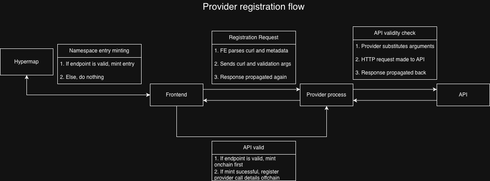

# Hypergrid

Hypergrid is the universal data protocol for the age of machine intelligence.

Built on the the Hyperware p2p stack, Hypergrid enables _Operators_ of AI workflows to access any kind of data or remote tool without any need for manual configuration, while the _Providers_ of those services get paid in stablecoins (USDC) on the Base blockchain. On either side of the market, it's as simple as configuring Hypergrid once and supercharging your AI forever. 

Actually, the Providers supercharge _other_ people's AI in exchange for supercharging their wallet... but they don't pay me to write good copy. Whatever. 

[Visit our website](https://grid.hyperware.ai) to more about Hypergrid.

### Overview

The Hypergrid protocol is divided into two kinds of participants, Operators and Providers. Although any user — which is to say, any Hyperware node with the Hypergrid client installed — could act as both at the same time, they serve entirely different purposes.

_Operators_ can be thought of as the "buy" side of the market. These participants are running some kind of agentic AI harness. It could be research assistant, a software development agent, or really anything else. Rather than manually configuring and keeping track all of the tools and data sources that they might want their model to use (hoping that they correctly predicted the full set of tasks and resulting data/tool requirements ahead of time), they simply configure a one-time connection to the Hypergrid client running on their Hyperware node. Top off an Operator wallet with USDC, and instantly get hands-free permissionless access to the constantly growing market of data feeds and remote tools. No middlemen, no subscriptions, no mysterious credit systems to keep an eye on.

_Providers_ can be thought of as the "sell" side of the market. Each provider (a single node/client can host multiple) is loosely categorized into the "data feed" category and the "tool" category. At the moment, the main job of providers is to sit in front of any existing HTTP endpoint and package it into a format that Operators can easily discover and use it. This is the core Provider mechanic supported by the 1.0 version of the Hypergrid client, but more complex provider interactions and configuration options will be added in subsequent releases.

Similarly to the split between protocol participants, the protocol itself is comprised of multiple layers of on-chain and off-chain interaction. It uses a known [Hypermap](https://book.hyperware.ai/getting_started/hypermap.html) namespace to allow Operators to permissionlessly discover the set of available Providers along with some metadata about them. This metadata could include information about what the Provider can do, natural language instructions (to be parsed by an LLM) on how to use it, and then two key pieces of information that allow the protocol to function: the provider's wallet and their Hyperware node name.

Although it isn't required, in many cases a Provider might have some reason to charge a fee for access to their services. Hypergrid uses a "just in time micropayments" solution, where the Operator node (in response to a tool call from a connected AI agent) optimistically sends the required payment to the Provider's wallet. Because the transaction was sent from the built-in Hyperware wallet, which can be trustlessly identified as being controlled by the owner of the Operator, the Provider can then instantly validate and debit that transaction in exchange for whatever service it is providing. There is a sophisticated offchain layer here, and thanks to Hyperware's batteries-included p2p messaging, the node name of the Provider is totally sufficient to engage in a handshake, payment, request, and response in seconds.

At the moment the best supported way to use Hypergrid as an Operator is via an MCP ([Model Context Protocol](https://modelcontextprotocol.io)) server shim that you can authorize with a simple command to communicate with your Hyperware node, search the Provider registry, and make calls to anything it finds there.

Look at the [Operator docs](operator/README.md) to learn more about Hypergrid.

Look at the [Provider docs](provider/README.md) to more about Hypergrid.

Look at the [Shim docs](hypergrid-shim/README.md) to more about Hypergrid.


### Usage
For stable versions, it is best to get the package directly from our decentralized app store: Hypergrid is published by `ware.hypr`.

For those looking to build the client from source, make sure you have the following:

- [kit (dapp development tool)](https://github.com/hyperware-ai/kit) 
- [hyperdrive (our app runtime)](https://github.com/hyperware-ai/hyperdrive)

After gathering the necessary dependancies, you can run:
```bash
sh build.sh # Default is staging which indexes obfusc-grid123.hypr namespace
sh build.sh --env production # This ensures we are indexing the main namespace: grid.hypr
```

### Flow



### Notes

If you want to build the Hypergrid client from source, be sure that you're using a branch of `kit` (the Hyperware dev tool) that supports the "Hyperapp" framework. To successfully install the client you must also on a Hyperware runtime version 15.1.0 or higher (this is when the Hyperwallet was introduced as a default system process, Hypergrid will crash without it).


### Custom Build Script and Staging/Production environments
Because operator and provider are (for the time being) two distinct process environments (hyperapp and regular process), the custom build script `build.sh` ensures that the resulting package is installable and works. The script has also been modified to use constants for segmenting staging and production environments (so that ongoing testing work does pollute the grid.hypr namespace)
