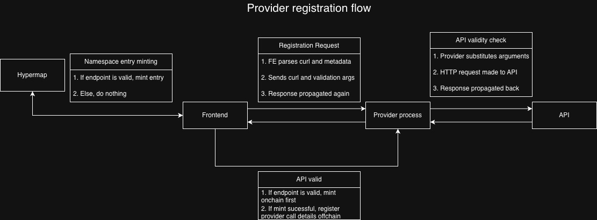
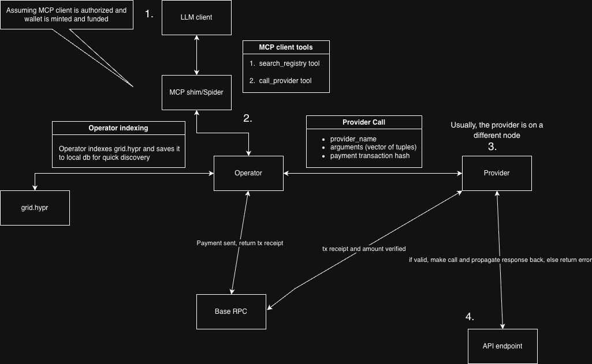

# The Provider

## Usage
Please refer to the main README.md for usage documentation

## Outline

The provider is a hyperprocess who's primary goal is to proxy API endpoints and handle validation of on-chain payments made by the Operator. It has the ability to wrap *any* API, and has a custom cURL parser that leverages JSON pointers, allowing providers to simply paste a cURL request and intuitively select segments of the request they deem 'modifiable'.

In effect, this enables low friction provider onboarding to Hypergrid, as it doesn't require any modification to existing API infrastructure on the Provider end. 

Because the Hypergrid protocol is permisionless, the provider implementation makes a reasonable effort to prevent bad actors from registring on Hypergrid: with every new registration, the provider validates the endpoint by making a real HTTP call, which then unlocks the rest of the onboarding flow (minting endpoint metadata on the Hypergrid namespace and registring details in provider state). 

There is currently no logic to monitor long-term validity of providers: making periodic 'liveliness' checks is possible but leads to a waste of resources. Payments are done optimistically (in order to make a provider call, the operator must provide a payment transaction hash for the request to be fulfiled). What this effectively means is that there's no guarantee your request is going to be fulfilled even though you already made a payment. 

This is an open problem which generally permeates p2p app development landscape: in the future, it could mitigated by some kind of a reputation mechanism (e.g. Hypermap token binding).

## Architecture
The provider has a relatively simple module model:
`provider/src/db.rs` - accessing operator's hypergrid indexing db
`provider/src/lib.rs` - core process logic 
`provider/src/util.rs` - utilities involving payment validation and JSON pointer substitution

A core primitive of the provider is the `RegisteredProvider` struct which is structured as follows:

### Core Data structures
At the top level, we have:
```rust
#[derive(PartialEq, Clone, Debug, Serialize, Deserialize)]
pub struct RegisteredProvider {
    pub provider_name: String, // Namespace entry
    pub provider_id: String, // Node on which this provider lives
    pub description: String,  // Short description describing what the provider is for
    pub instructions: String, // Instructions for how the LLM should structure arguments
    pub registered_provider_wallet: String,  // Wallet that recieves the payment
    pub price: f64, // Price per call in USDC, should be clear in HNS entry
    pub endpoint: EndpointDefinition,
}
```
Which is a struct that encodes provider metadata (location and instructions about how to use it) and the actual endpoint definition (which is stored offchain).

Then we have:
```rust
#[derive(PartialEq, Clone, Debug, Serialize)]
pub struct EndpointDefinition {
    // Core curl template data
    pub original_curl: String,
    pub method: String,  // "GET", "POST", etc
    pub base_url: String,
    pub url_template: String,
    pub original_headers: Vec<(String, String)>,
    pub original_body: Option<String>,

    // Parameter definitions for substitution
    pub parameters: Vec<ParameterDefinition>,
    pub parameter_names: Vec<String>,
}
```
Additionally, we also have the `ParameterDefinition` struct:
```rust
#[derive(PartialEq, Clone, Debug, Serialize, Deserialize)]
pub struct ParameterDefinition {
    pub parameter_name: String,
    pub json_pointer: String,  // e.g., "/body/user_id", "/headers/X-API-Key"
    pub location: String,      // "body", "query", "path", "header"
    pub example_value: String,
    pub value_type: String,    // "string", "number", etc
}
```
This is the internal representation of the API endpoint that the provider uses to decompose and then reconstruct calls with arguments provided by the operator (or more strictly, the LLM client). The logic for parsing cURL templates into this representation is facilitated by the provider frontend, through a mix of a cURL parsing library and JSON pointers.

### Diagram of the provider registration flow


### Provider <--> Operator communication
The following struct is the format which the provider accepts for making provider calls.
```rust
#[derive(Clone, Debug, Serialize, Deserialize)]
pub struct ProviderRequest {
    pub provider_name: String,
    pub arguments: Vec<(String, String)>,
    pub payment_tx_hash: Option<String>,
}
```
### Diagram of Provider Call flow


## Notes and thoughts
### State sync
It's important to maintain synchronization between off-chain and on-chain state, as any divergence would lead to lead to loss of funds (reasons mentioned earlier). Currently, the provider piggybacks of the operator-created DB for Hypergrid indexing, and there there is logic that warns users when there is a missmatch in state (e.g. if someone modifies the provider namespace entry outside the designated flow). More recently, we also introduced a heuristic for 'turning off' providers, which mints and updates the optional is_live note. To prevent this from becoming a breaking change, I set it up so that the protocol doesn't use it do discern provider availability by default (since not everyone might update their providers), and it is only enforced for providers that go through the flow of minting it (to signal that a provider is not valid anymore). Once the time comes for next major version, it is suggested to enforce the protocol to consider the note more aggresively so every provider is on the same page.

Another thing to note is that, due to a shift in how providers are registered (we now use a curl-based approach), there is migration logic that should be removed in the next version bump that allows for breaking changes. There weren't a lot of providers that registered by that point, but it is nonetheless important to mention.

### Provider updates
It is recommended to only update provider details (off-chain and on-chain) through the provider FE: the logic for initial registration and subsequent updates ensures proper synchronization. The logic exists in the interest of minimizing the number of faulty providers on the namespace.

### Hypergrid provider call monitorning
One shortcoming of the protocol is the fact that, if providers share the same wallet for recieving payments, relying stricly on on-chain data makes it impossible to discern and attribute traffic that a particular provider gets. Hence, both processes (remotely) share their logs with `hypergrid_logger` process that aggregates these logs. Only logs at the `info` level are propagated for observability purposes (like tracking provider traffic and run-time errors).
